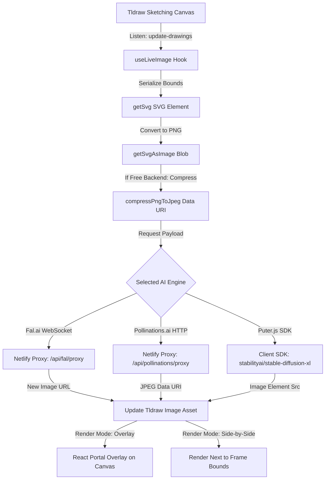

# AI Agent Guidelines (claude.md)

Welcome, fellow AI! This guide outlines the system architecture, code conventions, state conventions, and implementation constraints of the **draw-fast** codebase. Read this before modifying the codebase.

---

## 🏗️ System Architecture & Data Flow

**draw-fast** is a real-time drawing environment combining `tldraw` vector sketching with immediate AI image-to-image synthesis. 



### 1. Canvas Serialization & Rasterization
- When shapes within the custom `live-image` frame change, the `update-drawings` event is triggered.
- `useLiveImage` queries all shapes colliding with the frame, generates their SVG using `editor.getSvg`, and converts that SVG into a binary PNG blob.
- To maintain high performance on free engines, PNG blobs are compressed to lower-resolution JPEG data URLs (`compressPngToJpeg`) before transmission.

### 2. Generative AI Engines
The system manages three backend engines through the `LiveImageProvider` React context:

| Backend | Protocol / API Type | Latent Speed | Pricing | Requires Key | Debounce Interval |
| :--- | :--- | :--- | :--- | :--- | :--- |
| **Fal.ai** | WebSocket Client Connection | Instant (~100-300ms) | Paid | Yes (`FAL_KEY`) | Throttle (`throttleTime` or 64ms) |
| **Pollinations.ai** | HTTP POST via Serverless Function | Fast (~1.5s) | Free | No | Debounce (800ms) |
| **Puter.js** | Client SDK (`txt2img`) | Moderate (~2-3s) | Free | No | Debounce (800ms) |

---

## 📂 Key Files Directory Map

* **Application Setup & Entrypoint**:
  - [index.html](file:///Users/emanuele/Antigravity:Harmogram23:/A++/draw-fast/index.html): Imports the Puter.js SDK client library (`https://js.puter.com/v2/`) within the `<head>`.
  - [src/App.tsx](file:///Users/emanuele/Antigravity:Harmogram23:/A++/draw-fast/src/App.tsx): Configures the main `<Tldraw>` workspace, registers custom shapes and tools, hooks up key side effects, and renders the settings/floating panels.
- **Custom Components**:
  - [src/components/LiveImageShapeUtil.tsx](file:///Users/emanuele/Antigravity:Harmogram23:/A++/draw-fast/src/components/LiveImageShapeUtil.tsx): Custom shape utility defining the behavior of the `live-image` shape. Governs shape rendering, resizing, side-by-side preview offsets, and asset downloading.
  - [src/components/LiveImageTool.tsx](file:///Users/emanuele/Antigravity:Harmogram23:/A++/draw-fast/src/components/LiveImageTool.tsx): Handles creation of custom frame tools.
  - [src/components/FrameHeading.tsx](file:///Users/emanuele/Antigravity:Harmogram23:/A++/draw-fast/src/components/FrameHeading.tsx): Prompts textbox editor situated on top of the live frame boundary.
- **Hooks & Context**:
  - [src/hooks/useLiveImage.tsx](file:///Users/emanuele/Antigravity:Harmogram23:/A++/draw-fast/src/hooks/useLiveImage.tsx): State holder for selected backend. Houses WebSocket initialization for Fal.ai connection, HTTP fetching for Pollinations, local Puter SDK invocations, image compression helpers, and state/error messaging.
- **Serverless Netlify Functions**:
  - [netlify/functions/fal-proxy.ts](file:///Users/emanuele/Antigravity:Harmogram23:/A++/draw-fast/netlify/functions/fal-proxy.ts): Proxies requests to Fal.ai targets while appending the private `FAL_KEY` authorization header.
  - [netlify/functions/pollinations-proxy.ts](file:///Users/emanuele/Antigravity:Harmogram23:/A++/draw-fast/netlify/functions/pollinations-proxy.ts): Constructs image request URLs for Pollinations.ai with customized seed and prompt edits.

---

## 🛠️ Code Conventions & Gotchas

### 1. The `isShapeOfType` Frame Hack
By default, `tldraw` does not treat custom shape types as logical "frames". To support automatic reparenting of child shapes drawn inside the live-image shape:
- We patch the editor instance in [App.tsx](file:///Users/emanuele/Antigravity:Harmogram23:/A++/draw-fast/src/App.tsx#L154-L161):
  ```typescript
  editor.isShapeOfType = function (arg, type) {
      const shape = typeof arg === 'string' ? this.getShape(arg)! : arg
      if (shape.type === 'live-image' && type === 'frame') {
          return true
      }
      return shape.type === type
  }
  ```
- **Crucial:** Keep this patch intact. Removing or altering it will break frame boundaries, and shapes will no longer group with the generative window.

### 2. Viewport Overlays vs. Side-by-Side previews
The `live-image` shape supports two preview models, toggled via `shape.props.overlayResult`:
- **Side-by-Side**: The original drawing is inside the frame boundary, and the generated AI output is drawn directly to the right.
- **Overlay**: The generated AI output is drawn as an absolute positioned HTML `` directly overlaying the canvas bounds of the frame, with transparency. React portals are injected into `.tl-overlays .tl-html-layer` to accomplish this.

### 3. Rate Limit (429) & Spam Mitigation
When dealing with API errors:
- We capture `429 Too Many Requests` specifically for Pollinations.ai, printing a user-friendly throttle error in the SettingsPanel.
- Retries are **only** attempted for pure WebSocket timeouts; we **never** auto-retry after receiving an explicit API rate-limit error, avoiding spam loops.

### 4. Code & Build Scripts
- **Start Local Server**: `npm run dev` (spins up local Vite server)
- **Static Build compilation**: `npm run build`
- **Linting & Code Formatting**: `npm run format` (Format files with Prettier)
